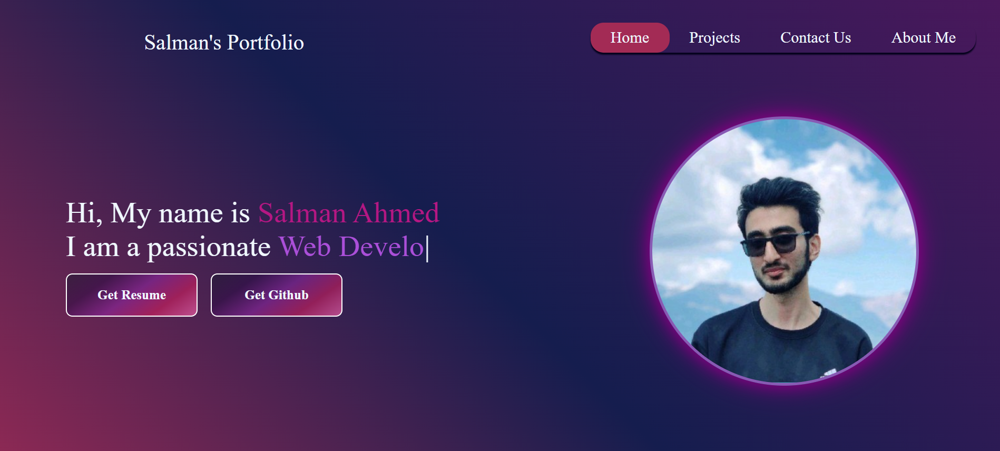

<h1 align="center">
  
  <br>
  <b>💼 Salman Ahmed Portfolio 🌐</b>
  <br>
  <i>Personal Developer Portfolio | Built with HTML, CSS, JS</i>
</h1>

<p align="center">
  <a href="#key-features">Key Features</a> •
  <a href="#how-to-use">How to Use</a> •
   <a href="#view">View</a> •
  <a href="#download">Download</a> •
  <a href="#technologies-used">Tech Stack</a> •
  <a href="#stats">Stats</a> •
  <a href="#credits">Credits</a> •
  <a href="#contact">Contact</a>
</p>

---

##  About the Project

This is my personal developer portfolio website showcasing who I am, my projects, technical skills, and how to reach me. Built from scratch using modern HTML, CSS, and JavaScript—deployed via GitHub Pages.

---

##  Key Features

- ✅ **Responsive Design** – Optimized for mobile, tablet, and desktop
- 🎨 **Animated UI** – Transitions, hover effects, and modern aesthetics
- 🧑‍💻 **About Me** – Quick overview of who I am
- 💡 **Skills Section** – Tech stack displayed with icons and badges
- 📁 **Project Gallery** – Highlights of selected projects with GitHub links
- 📫 **Contact Section** – Clickable email and LinkedIn integration
- 🎯 **Smooth Scrolling** – Navigation scrolls to specific sections
- 🌙 **Dark Theme** – Clean dark design for developers
- 🌐 **Live Deployment** – Hosted via GitHub Pages

---

##  How to Use

### ▶️ Clone the Repository
```bash
git clone https://github.com/salman-ahmed-2/portfolio
cd portfolio
```

### ▶️ Open in Browser
You can launch `welcome.html` by:

- Double-clicking the file  
- Opening with VS Code + Live Server  
- Or using terminal:
```bash
xdg-open welcome.html    # Linux
start welcome.html       # Windows
open welcome.html        # macOS
```

---
## view


<br><br>
.gif)
---
##  Download

To download manually:

1. Visit the [repository](https://github.com/salman-ahmed-2/portfolio)
2. Click the green `Code` button
3. Select `Download ZIP`
4. Extract and open `welcome.html`

---

##  Technologies Used


---

##  Stats

<p align="center">
  
  <br><br>
  
  <br><br>
  
</p>

---

##  Credits

- 👨‍💻 [HTML, CSS, JS] – For structure, style, and interactivity
- 🎨 [Google Fonts](https://fonts.google.com/)
- ⭐ [Font Awesome](https://fontawesome.com/) – Icons
- 🌄 [Unsplash](https://unsplash.com/) – Stock images (if used)
- 🚀 [GitHub Pages](https://pages.github.com/) – For deployment
- 💡 Inspired by open-source portfolio designs

---

##  Contact

- 📧 Email: [salmanahmed32121@gmail.com](mailto:salmanahmed32121@gmail.com)  
- 🌐 Portfolio: [GitHub Repo](https://github.com/salman-ahmed-2/portfolio)  
- 💼 LinkedIn: [Salman Ahmed Khan](https://www.linkedin.com/in/salman-ahmed-khan-843240226)

---

> © 2025 Salman Ahmed Khan — All rights reserved.
